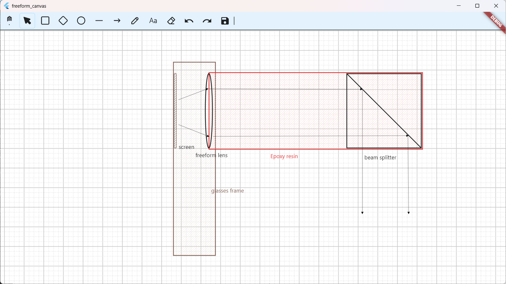
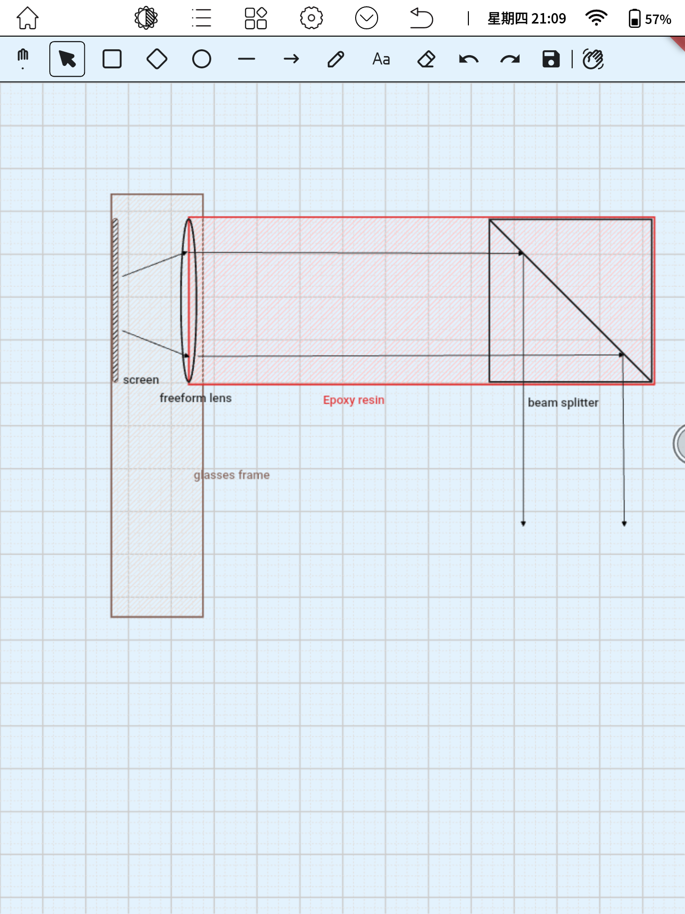

# freeform_canvas


[](https://www.apache.org/licenses/LICENSE-2.0)


**Read this in other languages:** [English](README.md) | [中文](README_ZH.md)

## Project Overview

freeform_canvas is an **Excalidraw-like whiteboard editor** built with Flutter.  
It aims to provide an Excalidraw-compatible whiteboard editor architecture, with a stronger focus on extensibility rather than 1:1 replication.

*Note: This project is not an official Excalidraw project and does not use or include any Excalidraw source code.*

The core features of freeform_canvas include:

* Single Source of Truth (SSOT) architecture (EditorState as the single source of state)
* Support for creating and editing rich elements, with undo / redo support
* Support for multiple interaction modes, including desktop, e-ink tablets, tablets, and mobile devices, with customizable interaction handlers
* A plugin-based editor architecture, allowing renderers, interactors, and overlay layers to be customized independently
* Support for most fields of the `.excalidraw` file format

One of the design goals is:

> **To restore many of Excalidraw’s editing behaviors, support the `.excalidraw` file format, adapt to diverse interaction styles such as e-ink tablets, desktop, mobile, and tablets, while maintaining a highly extensible and customizable system.**

## Quick Start

Add following contents to pubspec.yaml:
```yaml
dependencies:
  freeform_canvas:
    git:
      url: https://github.com/operator000/freeform_canvas.git
flutter:
  uses-material-design: true
  fonts:
    - family: freeform_canvas_icons
      fonts:
        - asset: packages/freeform_canvas/fonts/freeform_canvas_icons.ttf
```

This project provides “two” editors:
- One designed specifically for desktop environments with keyboard and mouse interaction
- One designed specifically for e-ink devices with stylus interaction

```dart
WindowsFreeformCanvas(
    jsonString: data,
    onSave: (file) {
    print('save...');
    },
)
```
```dart
EInkFreeformCanvas(
    jsonString: FreeformCanvasFileOps.emptyFile(),
    onSave: (file) {
    print('save...');
    },
)
```
They are referred to as “two” editors because the editor architecture is plugin-based.
The two editors share the same core, but differ entirely in their interaction logic and rendering logic.

A complete Flutter app example is available in `example\lib\main.dart`, which embeds a sample .excalidraw file.
You can run it on Windows directly to experience the editor.



For the editor designed for E-ink devices, it looks like this:

</img>

There's a pure file_rendering method, with a signature below:

File `lib\pure_renderer.dart`：
```dart
Future<ui.Image> renderFile({
  String? jsonString,
  File? file,
  required double Function(ui.Rect rect) scaleCalculator,
});
```

## Documentation
For a detailed introduction to the editor source code, including the editor component architecture and the flow of editing operations, please refer to the [Chinese documentation](docs/DOCUMENT_ZH.md) or the [English documentation](docs/DOCUMENT_EN.md).

This documentation can also serve as a reference for coding agents during development.

## Status & Contributing
This project is primarily built to meet my own use cases and may not be actively maintained as a long-term product.

That said, a key goal of **freeform_canvas** is to explore a highly extensible editor architecture, especially for diverse interaction scenarios (mouse, touch, stylus, e-ink, etc.).

Even if the core feature set remains relatively stable, the architecture is intentionally designed to be open to extension.
I believe there are many interesting directions this editor could grow into through different interaction models, renderers, or platform adaptations.

Contributions, experiments, and forks are all welcome.
If you implement new features or extensions that might be useful beyond your own use case, you are encouraged to consider contributing them back via pull requests.

Contributions of all kinds are very welcome — including bug fixes, refactors, performance improvements, documentation, and new features.

If you plan to fork this project to add your own features or platform-specific support, you are highly encouraged to consider contributing those improvements back via pull requests.  
Even partial or experimental implementations are welcome, as long as they help move the project forward.

I believe this project can grow better through shared ideas and collaboration.
If you are interested, feel free to open an issue, start a discussion, or submit a PR.